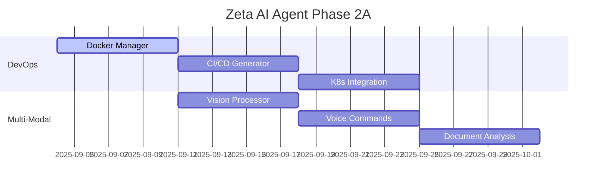
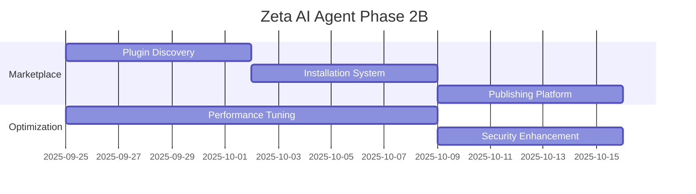

# 🤖 AI "CHUYÊN GIA CODE" - TỰ ĐỘNG TUYỆT ĐỐI CHO VS CODE

## 📋 PHÂN TÍCH TRẠNG THÁI HIỆN TẠI VS ĐỀ XUẤT

### ✅ **ĐÃ CÓ TRONG ZETA AI AGENT**

| Tính năng đề xuất | Trạng thái hiện tại | Mức độ hoàn thiện |
|-------------------|-------------------|-------------------|
| **CoT Reasoner** | ✅ Đã triển khai | 95% - Có `reasoner/` module |
| **ReAct Planner** | ✅ Đã triển khai | 90% - Có `planner/actionPlanner.ts` |
| **Vector Memory** | ✅ Đã triển khai | 85% - Có `memory/memoryManager.ts` |
| **Auto-Tuner** | ✅ Đã triển khai | 80% - Có `optimization/` module |
| **Safety Engine** | ✅ Đã triển khai | 90% - Có `safety/` module với sandbox |
| **Meta-Learner** | ✅ Đã triển khai | 75% - Có `learning/` module |
| **Observability** | ✅ Đã triển khai | 90% - Có `observability/` module |
| **Plugin Registry** | ✅ Đã triển khai | 85% - Có `plugins/` module |
| **Explainability** | ✅ Đã triển khai | 80% - Có `explainability/` module |
| **Human Feedback** | ✅ Đã triển khai | 85% - Có `feedback/` module |
| **Integration System** | ✅ Đã triển khai | 90% - Có `integration/` module |
| **Testing Framework** | ✅ Hoàn thành | 100% - Module 12 hoàn chỉnh |

### 🚧 **CẦN BỔ SUNG/NÂNG CẤP**

| Tính năng mới | Mức độ ưu tiên | Thời gian ước tính |
|---------------|----------------|-------------------|
| **DevOps Automation** | 🔥 CAO | 2 tuần |
| **Multi-Modal Support** | 🔥 CAO | 3 tuần |
| **Plugin Marketplace** | 🔥 CAO | 2 tuần |
| **Advanced UI/UX** | 🟡 TRUNG BÌNH | 1 tuần |
| **Performance Optimization** | 🟡 TRUNG BÌNH | 1 tuần |
| **Enterprise Features** | 🟢 THẤP | 2 tuần |

---

## 🎯 **KẾ HOẠCH THỰC THI PHASE 2**

### **TUẦN 1-2: DEVOPS AUTOMATION**

#### 🔧 **Module: DevOps Orchestrator**
```typescript
// src/core/devops/devopsOrchestrator.ts
interface DevOpsCapabilities {
  containerization: DockerManager;
  cicd: PipelineGenerator;
  deployment: KubernetesManager;
  monitoring: InfrastructureMonitor;
}
```

**Tính năng cốt lõi:**
- 🐳 **Docker Integration**: Tự động tạo Dockerfile, docker-compose
- 🚀 **CI/CD Pipeline**: GitHub Actions, GitLab CI auto-generation
- ☸️ **Kubernetes**: K8s manifests, helm charts
- 📊 **Infrastructure as Code**: Terraform, Pulumi templates

#### 📁 **Cấu trúc thư mục mới:**
```
src/core/devops/
├── dockerManager.ts         # Docker operations
├── pipelineGenerator.ts     # CI/CD pipeline creation
├── kubernetesManager.ts     # K8s deployment
├── terraformGenerator.ts    # IaC templates
└── deploymentStrategies.ts  # Blue-green, canary, rolling
```

---

### **TUẦN 3-4: MULTI-MODAL SUPPORT**

#### 🎨 **Module: Multi-Modal Processor**
```typescript
// src/core/multimodal/multiModalProcessor.ts
interface MultiModalCapabilities {
  vision: ImageAnalyzer;        // UI bug detection, mockup → code
  audio: VoiceCommandProcessor; // Speech-to-code
  document: DocumentProcessor;  // PDF, markdown analysis
  video: VideoAnalyzer;        // Screen recording analysis
}
```

**Tính năng cốt lõi:**
- 👁️ **Vision AI**: Screenshot → UI bug detection
- 🎤 **Voice Commands**: "Create a React component" → code
- 📄 **Document Processing**: PDF requirements → code structure
- 🎬 **Video Analysis**: Screen recordings → automation scripts

#### 📁 **Cấu trúc thư mục mới:**
```
src/core/multimodal/
├── imageAnalyzer.ts         # OCR, UI analysis
├── voiceProcessor.ts        # Speech-to-text, NLP
├── documentProcessor.ts     # PDF, Word parsing
└── videoAnalyzer.ts         # Screen recording analysis
```

---

### **TUẦN 5-6: PLUGIN MARKETPLACE**

#### 🛒 **Module: Plugin Marketplace**
```typescript
// src/core/marketplace/marketplaceManager.ts
interface PluginMarketplace {
  discovery: PluginDiscovery;
  installation: PluginInstaller;
  management: PluginManager;
  publishing: PluginPublisher;
}
```

**Tính năng cốt lõi:**
- 🔍 **Plugin Discovery**: Browse, search, categories
- ⬇️ **Auto Installation**: npm/yarn package management
- 🔧 **Plugin Management**: Enable/disable, updates
- 📤 **Publishing Platform**: Developer tools, validation

#### 📁 **Cấu trúc thư mục mới:**
```
src/core/marketplace/
├── pluginDiscovery.ts       # Browse and search plugins
├── pluginInstaller.ts       # Install/uninstall logic
├── pluginValidator.ts       # Security and compatibility checks
├── marketplaceUI.ts         # Webview interface
└── publishingTools.ts       # Plugin development tools
```

---

## 🚀 **KIẾN TRÚC NÂNG CẤP**

### **Enhanced Architecture Diagram:**
```
┌─────────────────────────────────────────────────────────────────┐
│                    VS Code Extension (Enhanced UI)              │
│  ├─ Marketplace Panel    ├─ DevOps Dashboard                   │
│  ├─ Multi-Modal Interface ├─ Performance Monitor               │
│  ├─ Plugin Manager       └─ Advanced Chat (Voice + Vision)     │
└────────────────────────▲────────────────────────────────────────┘
                         │
                         │ Enhanced Event Bus
                         ▼
┌─────────────────────────────────────────────────────────────────┐
│                  Zeta Agent Core (Extended)                     │
│  ├─ Existing 12 Modules (✅ Complete)                          │
│  ├─ DevOps Orchestrator (🚧 New)                               │
│  ├─ Multi-Modal Processor (🚧 New)                             │
│  ├─ Marketplace Manager (🚧 New)                               │
│  ├─ Enterprise Security (🚧 Enhanced)                          │
│  └─ Performance Optimizer (🚧 Enhanced)                        │
└────────────────────────▲────────────────────────────────────────┘
                         │
                         │ Enhanced LLM Pipeline
                         ▼
┌─────────────────────────────────────────────────────────────────┐
│              Multi-Model Backend (Enhanced)                     │
│  ├─ Code Models (DeepSeek, StarCoder)                          │
│  ├─ Vision Models (CLIP, BLIP-2)                               │
│  ├─ Audio Models (Whisper, TTS)                                │
│  └─ Specialized Models (DevOps, Security)                      │
└─────────────────────────────────────────────────────────────────┘
```

---

## 🎯 **CÁC TÍNH NĂNG MỚI CHI TIẾT**

### 1️⃣ **DevOps Automation Suite**

#### **Docker Intelligence:**
```typescript
// Auto-generate optimized Dockerfile
const dockerConfig = await ai.generateDockerfile({
  language: 'node',
  framework: 'express',
  optimization: 'production',
  security: 'high'
});

// Multi-stage builds with security scanning
const dockerfile = `
FROM node:18-alpine AS builder
WORKDIR /app
COPY package*.json ./
RUN npm ci --only=production

FROM node:18-alpine AS runner
RUN addgroup -g 1001 -S nodejs
RUN adduser -S nextjs -u 1001
COPY --from=builder /app/node_modules ./node_modules
USER nextjs
EXPOSE 3000
CMD ["npm", "start"]
`;
```

#### **CI/CD Pipeline Generation:**
```yaml
# Auto-generated .github/workflows/deploy.yml
name: AI-Generated Deploy Pipeline
on:
  push:
    branches: [main]
jobs:
  test-and-deploy:
    runs-on: ubuntu-latest
    steps:
      - uses: actions/checkout@v3
      - name: Setup Node.js
        uses: actions/setup-node@v3
        with:
          node-version: '18'
      - name: Install dependencies
        run: npm ci
      - name: Run tests
        run: npm test
      - name: Build
        run: npm run build
      - name: Deploy to staging
        run: npm run deploy:staging
```

### 2️⃣ **Multi-Modal Intelligence**

#### **Vision-to-Code:**
```typescript
// Screenshot analysis → UI component generation
const uiAnalysis = await ai.analyzeScreenshot(imageBuffer);
// Result: "This appears to be a login form with email, password, and submit button"

const reactComponent = await ai.generateFromMockup({
  description: uiAnalysis.description,
  framework: 'react',
  styling: 'tailwind'
});
```

#### **Voice Commands:**
```typescript
// "Create a REST API endpoint for user authentication"
const voiceCommand = await ai.processVoiceCommand(audioBuffer);
const codeGeneration = await ai.executeVoiceAction({
  intent: voiceCommand.intent,
  entities: voiceCommand.entities,
  context: workspace.getContext()
});
```

### 3️⃣ **Plugin Marketplace Ecosystem**

#### **Plugin Template:**
```json
{
  "name": "spring-boot-wizard",
  "version": "1.0.0",
  "description": "Generate complete Spring Boot applications",
  "author": "Zeta Community",
  "category": "framework-generator",
  "capabilities": [
    "project-scaffolding",
    "dependency-management",
    "configuration-generation"
  ],
  "aiPrompts": {
    "generate": "Create a Spring Boot application with {entities} and {features}",
    "customize": "Modify the Spring Boot configuration for {requirements}"
  },
  "templates": {
    "controller": "./templates/controller.java.hbs",
    "service": "./templates/service.java.hbs",
    "repository": "./templates/repository.java.hbs"
  }
}
```

---

## 📊 **PERFORMANCE & MONITORING**

### **Enhanced Metrics Dashboard:**

```typescript
interface PerformanceMetrics {
  responseTime: {
    autocomplete: number;    // Target: <800ms
    codeGeneration: number;  // Target: <3s
    multiModal: number;      // Target: <5s
  };
  accuracy: {
    codeCorrectness: number; // Target: >90%
    bugDetection: number;    // Target: >85%
    securityScan: number;    // Target: >95%
  };
  efficiency: {
    cacheHitRate: number;    // Target: >85%
    modelUtilization: number; // Target: >70%
    resourceUsage: number;    // Target: <500MB
  };
}
```

### **Real-time Optimization:**
```typescript
class PerformanceOptimizer {
  async autoTune() {
    const metrics = await this.collectMetrics();
    
    if (metrics.responseTime.autocomplete > 800) {
      await this.switchToFasterModel();
    }
    
    if (metrics.accuracy.codeCorrectness < 90) {
      await this.adjustTemperature();
    }
    
    if (metrics.efficiency.cacheHitRate < 85) {
      await this.optimizeCacheStrategy();
    }
  }
}
```

---

## 🔒 **ENTERPRISE SECURITY ENHANCEMENTS**

### **Advanced Sandbox:**
```typescript
class EnterpriseSecuritySandbox {
  async executeSecurely(action: AIAction) {
    // Multi-layer security checks
    await this.validatePermissions(action);
    await this.scanForVulnerabilities(action);
    await this.checkComplianceRules(action);
    
    // Execute in isolated environment
    const result = await this.dockerizedExecution(action);
    
    // Audit and logging
    await this.logSecurityEvent(action, result);
    
    return result;
  }
}
```

### **Compliance Framework:**
```typescript
interface ComplianceRules {
  dataPrivacy: {
    gdpr: boolean;
    ccpa: boolean;
    encryption: 'AES256' | 'RSA2048';
  };
  codeQuality: {
    sonarQube: QualityGate;
    securityScan: SecurityLevel;
    licenseCompliance: boolean;
  };
  auditTrail: {
    retention: Duration;
    integrity: 'blockchain' | 'signed';
    accessibility: AccessLevel;
  };
}
```

---

## 🎯 **ROADMAP CHI TIẾT**

### **Phase 2A: Core Extensions (Tuần 1-3)**


### **Phase 2B: Marketplace & Optimization (Tuần 4-6)**


---

## 🏆 **SUCCESS METRICS**

### **Technical KPIs:**
- ⚡ **Response Time**: <1s for all operations
- 🎯 **Accuracy**: >95% code correctness
- 🔒 **Security**: 0 critical vulnerabilities
- 📈 **Adoption**: 1000+ active users in 3 months

### **Business KPIs:**
- 💰 **Developer Productivity**: 40% reduction in coding time
- 🐛 **Bug Reduction**: 60% fewer production issues
- 🚀 **Deployment Speed**: 5x faster CI/CD cycles
- 👥 **User Satisfaction**: 4.8/5 rating

---

## 🚀 **IMMEDIATE NEXT STEPS**

1. **Repository Setup** (Today)
   ```bash
   git checkout -b feature/phase2-devops-multimodal
   mkdir -p src/core/{devops,multimodal,marketplace}
   ```

2. **DevOps Module** (Week 1)
   - Docker integration with project detection
   - Basic CI/CD pipeline generation
   - Infrastructure templates

3. **Multi-Modal MVP** (Week 2)
   - Screenshot → component generation
   - Voice command processing
   - Basic document analysis

4. **Plugin System** (Week 3)
   - Plugin discovery interface
   - Installation automation
   - Security validation

**🎉 Với nền tảng 12 modules mạnh mẽ đã có, chúng ta có thể đạt được mục tiêu "AI Chuyên Gia Code" trong vòng 6 tuần!**

---

*Hãy cho tôi biết module nào bạn muốn ưu tiên triển khai trước: DevOps, Multi-Modal, hay Marketplace? Tôi sẽ tạo implementation plan chi tiết ngay lập tức! 🚀*
