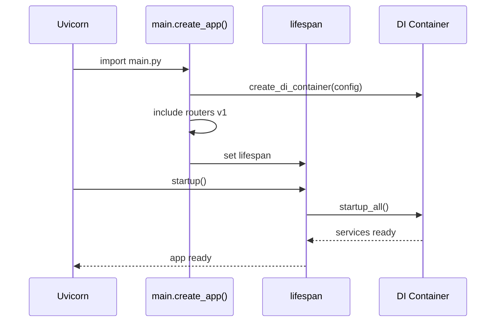

# PROJECT_MAP — ZETA_VN (FastAPI + DI + Observability)

> **Mục tiêu:** Cung cấp bản đồ dự án + skeleton code đủ chạy để Copilot/AI scaffold đúng chuẩn.
> Kiến trúc: FastAPI + Clean Architecture + DI Container + Lifespan + RBAC + Observability (Prometheus/OTel) + CI OpenAPI.

## 1) Định nghĩa mục tiêu dự án (Done = True khi)
- **Security**: JWT/OAuth2 + RBAC (scope-based), rate-limit theo user tier, audit log ở các write ops.
- **Observability**: `/metrics` Prometheus + tracing (OTel-ready), `/health` tổng hợp DB/Cache.
- **Quality**: ruff + mypy + pytest + bandit + pip-audit pass; coverage ≥ 85%; OpenAPI export trong CI.
- **API**: Prefix `/api/v1`, error JSON chuẩn, WebSocket cho chat-stream (mở rộng sau).

---

## 2) Cấu trúc thư mục (rút gọn)
```
zeta_vn/
  app/
    api/
      v1/
        __init__.py
        assistants.py
        analytics.py
        admin.py
      websockets/
        __init__.py
        chat_websocket.py        # (placeholder)
    middleware/
      __init__.py
      permissions.py
    observability/
      __init__.py
      metrics.py
    security/
      __init__.py
      jwt.py                     # (placeholder to implement real JWT later)
    di_container.py
    dependencies.py
    lifespan.py
    main.py
scripts/
  export_openapi.py
tools/
  inventory_project.py            # script inventory (rút gọn từ bản đầy đủ)
PROJECT_MAP.md
```

---

## 2) Mô tả chức năng chi tiết theo từng file/thư mục

Lưu ý: mình bám đúng cây hiện có (trích từ PROJECT_MAP + code), và nêu rõ vai trò, hành vi mong đợi, bảo mật/observability, checklist cho Copilot.

### 2.1. zeta_vn/app/main.py

**Vai trò:** Entry-point FastAPI production-grade. Tạo app instance với factory pattern, cấu hình docs/OpenAPI, add middleware stack, đăng ký exception handlers & routers, thêm endpoints built-in (health/metrics), gắn lifespan management.

**Hành vi:**
- `create_app()` trả FastAPI instance đã cấu hình đầy đủ với `default_response_class=ORJSONResponse` (fallback JSONResponse), `lifespan=lifespan`
- OpenAPI tags chuẩn hoá cho Health/Authentication/AI Agents/Conversations/Users/Analytics/Administration/File Management/Notifications/Dashboard/Training/WebSocket/Monitoring
- Graceful import handling cho optional dependencies (Prometheus, Sentry, performance middleware)
- Auto-discovery và registration của routers từ `app.api.v1.*` và `app.websockets.*`
- Comprehensive middleware stack: CORS, GZip, TrustedHost, custom security, logging, rate limiting, performance
- Built-in endpoints: `/api/v1/health` (component health checks with 503 on degraded), `/api/v1/ready` (K8s readiness probe), `/metrics` (Prometheus metrics nếu enabled)
- DI container integration: `app.state.di_container` với lifecycle hooks
- Start time tracking: `app.state.start_time` cho uptime calculation

**Bảo mật & Observability:**
- Optional Sentry integration với FastAPI/Starlette instrumentation
- Prometheus metrics: `http_requests_total`, `http_request_duration_seconds`
- Security middleware enforcement (auth + RBAC) nếu available
- Health checks thực tế cho database connectivity với response time tracking
- Error handling với custom exception handlers và fallback mechanisms

**Checklist Copilot:**
- ✅ Có `_add_middleware`, `_register_exception_handlers`, `_register_routers`, `_add_builtin_endpoints` được gọi trong `create_app()`
- ✅ `/api/v1/health` trả về component status với database connectivity test, 503 nếu degraded
- ✅ `/api/v1/ready` trả về readiness status cho K8s probes với DI container + database pool checks
- ✅ `/metrics` trả về Prometheus registry (503 nếu ENABLE_METRICS=false hoặc chưa sẵn)
- ✅ OpenAPI docs conditional dựa trên `ENABLE_DOCS` environment variable
- ✅ Graceful startup/shutdown qua lifespan với DI container lifecycle
- ✅ Start time tracking và uptime calculation trong health endpoints

### 2.2. zeta_vn/app/lifespan.py

**Vai trò:** Quản lý vòng đời app: startup/shutdown, health/cleanup loops, init DB/Redis/external services, expose lifespan(app) context manager cho FastAPI. Tích hợp với DI container lifecycle management.

**Hành vi:**
- Startup sequence: `_init_di_container()` → `_init_database()` → `_init_redis()` → `_init_external_services()` → `_start_background_tasks()` → `_validate_system_health()`
- Shutdown sequence: `_shutdown_di_container()` → `_stop_background_tasks()` → `_close_redis()` → `_close_database()` → `_cleanup_external_services()`
- Background loops: `_health_check_loop()` (5-minute intervals), `_cleanup_loop()` (hourly session TTL cleanup)
- Health tracking: `_check_database_health()`, `_check_redis_health()` với optional Redis dependency
- Global `lifespan_manager` instance và `lifespan(app)` context manager cho FastAPI
- `set_app(app)` method để access DI container qua `app.state.di_container`
- `is_ready` property phản ánh startup complete và chưa shutdown

**Bảo mật & Observability:**
- Graceful error handling với detailed logging cho startup/shutdown failures
- Health checks không block application startup (best-effort external services)
- Redis optional - không fail startup nếu không available
- Session cleanup với TTL management để prevent memory leaks
- Comprehensive logging với emoji indicators cho visibility

**Checklist Copilot:**
- ✅ Có log start/shutdown rõ ràng (`🚀 Starting...`, `✅ completed`, `❌ failed`) & background loops được dừng an toàn với `asyncio.CancelledError` handling
- ✅ Redis optional (không làm fail startup nếu thiếu) - check `settings.redis_enabled` và graceful fallback
- ✅ Background tasks (health check + cleanup) được track trong `self.background_tasks` list
- ✅ DI container integration với `_init_di_container()` và `_shutdown_di_container()` calls
- ✅ Health validation (`_validate_system_health()`) trước khi mark `_startup_complete = True`

### 2.3. zeta_vn/app/di_container.py

**Vai trò:** Comprehensive DI Container + Service lifecycle (db/cache/external), đăng ký singleton/factory/scoped/transient patterns, health_check aggregation từng service, dependency graph resolution.

**Hành vi:**
- **Service Registration**: `register_singleton()`, `register_factory()`, `register_transient()`, `register_scoped()` với dependency tracking
- **DatabaseService**: Dynamic import `async_session_maker` từ `data.models.base` → SQLAlchemy async session management với connection testing
- **CacheService**: Dynamic import `CacheClient` từ `data.external.cache_client` với fallback to memory dict cache
- **Lifecycle Management**: `startup_all()`, `shutdown_all()` cascade calls cho tất cả `ServiceLifecycle` services
- **Health Aggregation**: `health_check_all()` collect status từ mọi service với structured response format
- **Service Resolution**: Dependency graph resolution với async service creation và scoped service support
- **Factory Function**: `create_di_container(config)` đăng ký config, database_service, cache_service với dependency links

**Bảo mật & Observability:**
- Service isolation qua interface `ServiceLifecycle` với mandatory `startup()`, `shutdown()`, `health_check()`
- Graceful import handling với fallback mechanisms cho optional dependencies
- Structured health check responses: `{"status": "healthy/unhealthy", "message": "...", "error": "..."}`
- Debug logging cho service registration và dependency resolution
- Error propagation với context preservation trong service factories

**Checklist Copilot:**
- ✅ Mọi service có `startup()`, `shutdown()`, `health_check()` rõ ràng implement từ `ServiceLifecycle` interface
- ✅ App (main/lifespan) thực sự gọi `startup_all()`, `shutdown_all()` (container được nối vào lifespan qua `app.state.di_container`)
- ✅ Database service có real connection test trong health check (`SELECT 1` query với timeout)
- ✅ Cache service có fallback graceful nếu Redis unavailable (memory dict cache hoặc no-op cache)
- ✅ Service factory functions return actual implementations (không giữ stub `pass` quá lâu)
- ✅ Dependency graph resolution không có circular dependencies

### 2.4. zeta_vn/app/dependencies.py (+ dependencies_v2.py nếu dùng)

**Vai trò:** Factory cho DI trong FastAPI endpoints; chuẩn hoá auth JWT → `get_current_user`, `get_current_admin_user`, `require_permissions(...)`; tạo service instances (auth/agent/chat/memory/analytics/…).

**Hành vi:**
- **Authentication Flow**: `get_current_user()` extract JWT → validate token → return `User` entity với scopes/role
- **Authorization RBAC**: `require_permissions(scopes: str | Iterable[str])` factory dependency enforcing permission checks
- **Admin Access**: `get_current_admin_user()` shortcut requiring `role == "admin"`
- **Service Factories**: 20+ service getters (`get_auth_service()`, `get_agent_service()`, `get_chat_service()`, etc.) với dynamic imports
- **Repository Factories**: `get_user_repository()`, `get_agent_repository()`, `get_chat_repository()` với `AsyncSession` injection
- **Database Session**: `get_db_session()` unified source-of-truth cho database sessions với async generator pattern
- **Audit Logging**: `log_security_event()` helper cho security audit trail với structured logging
- **Development Mode**: JWT verification mocked để dev/test dễ dàng - cần enable verify thật cho production

**Bảo mật & Observability:**
- RBAC scope checking với admin wildcard (`"*"`) và role-based permissions (`"admin"` has all access)
- Security audit logging cho mọi auth events với user_id, resource, timestamp
- JWT token validation với proper error handling (401 Unauthorized)
- Session management qua DI-controlled `AsyncSession` lifecycle
- Permission granularity: domain:action format (`"agents:read"`, `"agents:write"`, `"training:*"`)

**Lưu ý Development:** Bản hiện tại đang mock user với `get_dev_user()` để dev/test — cần bật verify JWT thật cho production environment.

**Checklist Copilot:**
- ✅ `require_permissions()` kiểm tra scopes (list) hoặc cho phép `"*"` bypass admin với proper RBAC logic
- ✅ Service factory functions trả về actual implementations (không giữ stub `# type: ignore[empty-body]` quá lâu)
- ✅ JWT validation real cho production (không mock `get_dev_user()` trong prod deployment)
- ✅ Database session dependency unified qua `get_db_session()` cho consistency
- ✅ Admin users có wildcard access và proper role checking
- ✅ Security audit events logged với structured format cho compliance

### 2.5. Routers API — zeta_vn/app/api/v1/*.py

**Các file v1 hiện có**: admin.py, agents.py, analytics.py, assistants.py, auth.py, automation.py, chat.py, dashboard.py, demo_di.py, files.py, health.py, learning.py, memory.py, performance.py, planning.py, reflexion.py, settings.py, streaming.py, system.py, training.py, voice.py.

**Quy ước chung:**
- **URL Convention**: Bắt buộc prefix `/api/v1/...` cho tất cả endpoints với proper REST resource naming
- **Response Standards**: Status codes chuẩn HTTP + error JSON format consistency `{"error_code": "...", "message": "..."}`
- **Authentication**: Mọi endpoint có `Depends(require_permissions([...]))` cho RBAC enforcement
- **Request/Response**: Pydantic models cho serialization/validation (`AgentCreateIn`, `AgentOut`, etc.)
- **Service Injection**: `Depends(get_*_service)` pattern cho business logic delegation
- **User Context**: `Depends(get_current_user)` inject current user principal

**Router Implementation Pattern:**
```python
router = APIRouter(prefix="/resource", tags=["Resource Name"])

@router.post("",
    response_model=ResourceOut,
    status_code=status.HTTP_201_CREATED,
    dependencies=[Depends(require_permissions(["resource:write"]))]
)
def create_resource(
    payload: Annotated[ResourceCreateIn, Body()],
    svc: Annotated[ResourceService, Depends(get_resource_service)],
    user: Annotated[User, Depends(get_current_user)]
) -> ResourceOut:
    # Business logic in service layer
```

**WebSocket Pattern** (cho chat streaming):
- **Template WS Flow**: accept → read → validate → process → send → error handling
- **Connection Management**: `WebSocketConnectionManager` cho multi-user/conversation tracking
- **Authentication**: WebSocket token validation separate từ HTTP JWT flow
- **Message Streaming**: Real-time chat với agent responses và conversation history
- **Error Handling**: Graceful disconnect với `WebSocketDisconnect` exception management

**Checklist Copilot:**
- ✅ Tất cả routers có prefix `/api/v1/...` và consistent URL patterns
- ✅ RBAC dependencies trên mọi sensitive endpoints với appropriate permissions
- ✅ Pydantic serializers cho request/response validation và OpenAPI generation
- ✅ Service layer delegation (không business logic trong router layer)
- ✅ Error handling consistent với structured JSON error responses
- ✅ WebSocket authentication và connection lifecycle management proper
- ✅ Current user injection cho audit trail và business logic context
- ✅ Mọi service có `startup()`, `shutdown()`, `health_check()` methods implemented qua `ServiceLifecycle` interface
- ✅ App (main/lifespan) thực sự gọi `startup_all()`, `shutdown_all()` qua DI container integration
- ✅ Database service test connection với `SELECT 1` query trong startup và health checks
- ✅ Cache service có fallback to memory dict nếu external cache không available
- ✅ Service factories có dependency injection với `dependencies=["config"]` parameter
- ✅ Health check aggregation return structured dict với service names as keys

---

## 3) Cấu trúc thư mục (rút gọn)
```
zeta_vn/
  app/
    api/
      v1/
        __init__.py
        assistants.py
        analytics.py
        admin.py
      websockets/
        __init__.py
        chat_websocket.py        # (placeholder)
    middleware/
      __init__.py
      permissions.py
    observability/
      __init__.py
      metrics.py
    security/
      __init__.py
      jwt.py                     # (placeholder to implement real JWT later)
    di_container.py
    dependencies.py
    lifespan.py
    main.py
scripts/
  export_openapi.py
tools/
  inventory_project.py            # script inventory (rút gọn từ bản đầy đủ)
PROJECT_MAP.md
```

---

## 4) Vai trò từng phần (tóm tắt kiểm nhanh)
- **main.py**: Entry-point tạo FastAPI app, add middleware, đăng ký router v1, gắn `/metrics`, `/health`, tích hợp DI vào `app.state`.
- **lifespan.py**: Startup/shutdown tài nguyên; gọi `container.startup_all()/shutdown_all()`, set `app.state.is_ready`.
- **di_container.py**: DI Container + `DatabaseService` (SQLAlchemy async), `CacheService` (Redis optional).
- **dependencies.py**: JWT/RBAC deps (`get_current_user`, `require_permissions`), factories service/repo.
- **middleware/permissions.py**: (Tuỳ chọn) mapping scopes; demo để attach user scopes vào request.state.
- **observability/metrics.py**: Registry Prometheus, counters/histograms cơ bản.
- **api/v1/**: Routers chuẩn hoá (assistants/analytics/admin) – đủ mẫu CRUD/query và RBAC.
- **scripts/export_openapi.py**: Xuất OpenAPI -> `reports/openapi.json` (dùng trong CI).
- **tools/inventory_project.py**: Thống kê dự án (tree/files/import graph) – bản rút gọn dễ chạy.

---

## 5) Mermaid — Sơ đồ luồng khởi động


## 6) Mermaid — Tầng DI và API
```mermaid
graph TD
  C[DIContainer] -- singleton --> DB[DatabaseService]
  C -- singleton --> Cache[CacheService]
  RouterV1[/APIRouter v1/] --> Assistants[assistants.py]
  RouterV1 --> Analytics[analytics.py]
  RouterV1 --> Admin[admin.py]
  Assistants -- Depends --> deps[get_assistant_service()/require_permissions]
  Analytics -- Depends --> deps
  Admin -- Depends --> deps
```

---

## 7) Checklist cho Copilot/PR
- [ ] **Security**: `require_permissions(...)` nằm trên mọi route nhạy cảm; JWT không mock trong prod.
- [ ] **Observability**: `/metrics` có số liệu request/latency; `/health` kiểm DB/Cache, trạng thái `ready` phản ánh đúng.
- [ ] **DI**: `app.state.di_container` tồn tại; lifespan gọi `startup_all()/shutdown_all()`.
- [ ] **API**: `/api/v1/*` dùng Pydantic models; trả `ErrorResponse` thống nhất.
- [ ] **CI**: `scripts/export_openapi.py` chạy OK; tạo `reports/openapi.json`.

---

## 8) Hướng dẫn chạy nhanh (dev)
```bash
uvicorn zeta_vn.app.main:app --reload --host 0.0.0.0 --port 8000
# Export OpenAPI
python scripts/export_openapi.py
# Inventory (rút gọn)
python tools/inventory_project.py --pkg zeta_vn
```
