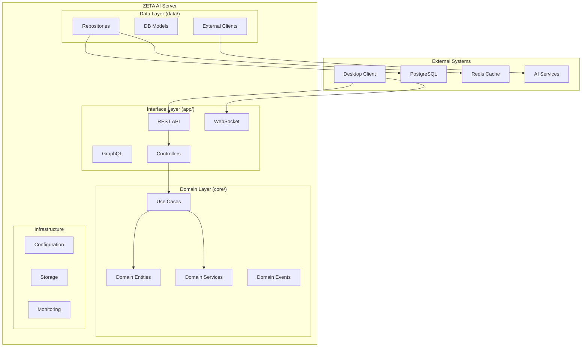
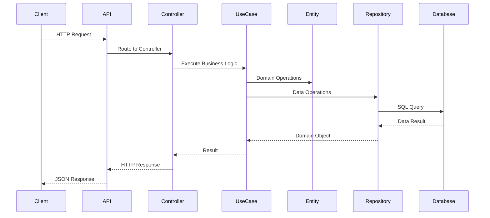
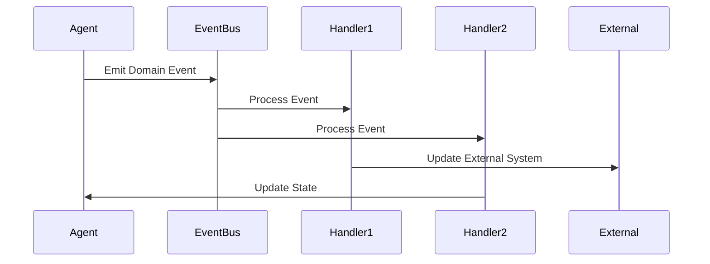
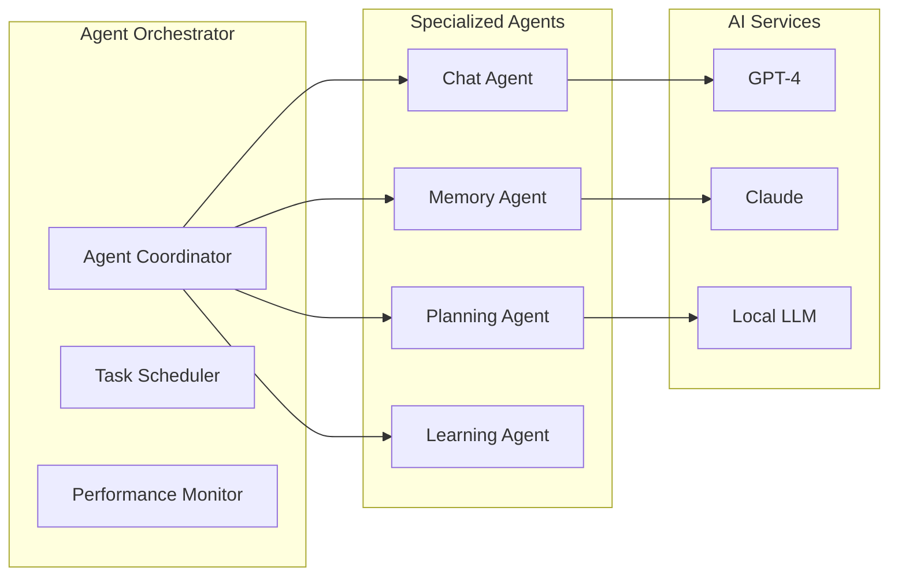
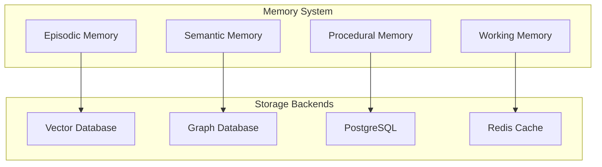
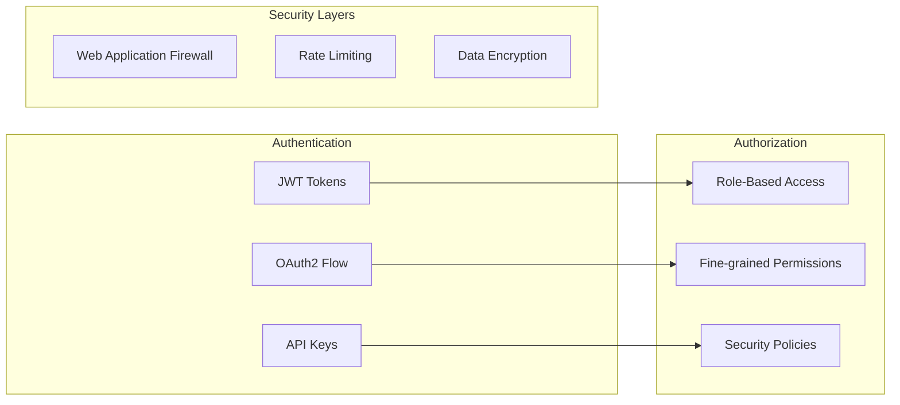
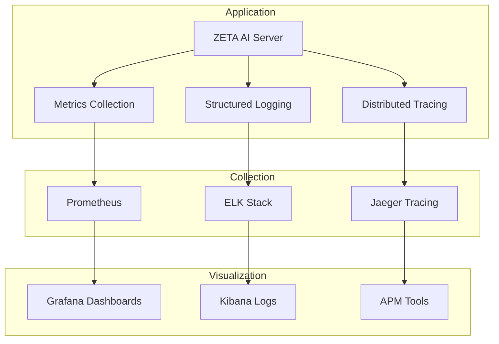
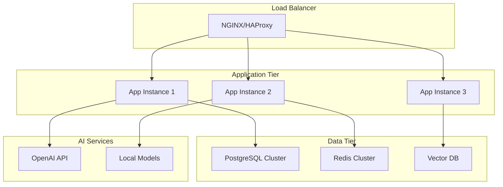

# ZETA AI Server - Architecture Guide

## 🏛️ System Architecture Overview

ZETA AI Server is built using **Clean Architecture** principles, ensuring separation of concerns, testability, and maintainability. The system is designed to support AI-powered apps/desktop assistance with multi-agent orchestration.

## 🎯 Core Design Principles

### 1. Clean Architecture (8-Layer Pattern)
- **Separation of Concerns**: Each layer has a single responsibility
- **Dependency Inversion**: Dependencies point inward toward the domain
- **Framework Independence**: Core business logic independent of frameworks
- **Testability**: Easy to test each layer in isolation

### 2. Domain-Driven Design (DDD)
- **Bounded Contexts**: Clear boundaries between different business domains
- **Entities**: Core business objects with identity and lifecycle
- **Value Objects**: Immutable objects representing concepts
- **Domain Services**: Business logic that doesn't belong to entities

### 3. CQRS & Event Sourcing
- **Command Query Responsibility Segregation**: Separate read and write models
- **Event Sourcing**: Store domain events for audit and replay
- **Event-Driven Architecture**: Loosely coupled components via events

## 🏗️ Layer Architecture



## 📁 Detailed Layer Breakdown

### 1. Interface Layer (`app/`)
**Responsibility**: Handle external communication and user interfaces

```
app/
├── api/
│   ├── v1/          # REST API v1 endpoints
│   ├── v2/          # REST API v2 endpoints
│   ├── websockets/  # Real-time WebSocket connections
│   ├── graphql/     # GraphQL schema and resolvers
│   └── middleware/  # Request/response middleware
├── controllers/     # Interface controllers for different clients
├── serializers/     # Data transformation (Pydantic schemas)
├── validators/      # Input validation logic
└── exceptions/      # HTTP exception handling
```

**Key Components**:
- **REST API**: RESTful endpoints for CRUD operations
- **WebSocket**: Real-time communication for live updates
- **GraphQL**: Flexible query interface for complex data needs
- **Controllers**: Specialized interfaces (CLI, mobile, voice)

### 2. Domain Layer (`core/`)
**Responsibility**: Business logic and domain knowledge

```
core/
├── domain/
│   ├── entities/       # Core business entities
│   ├── value_objects/  # Immutable value objects
│   ├── events/         # Domain events
│   └── specifications/ # Business rules and validation
├── use_cases/         # Application business logic
│   ├── agents/        # Agent management use cases
│   ├── memory/        # Memory operations use cases
│   ├── chat/          # Chat functionality use cases
│   └── planning/      # AI planning use cases
├── services/          # Domain services
└── interfaces/        # Abstract interfaces (protocols)
```

**Key Entities**:
- **Agent**: AI assistant with capabilities and configuration
- **Memory**: Stored knowledge and experiences
- **Chat**: Conversation management and history
- **User**: System users with preferences and permissions
- **Task**: Executable units of work

### 3. Data Layer (`data/`)
**Responsibility**: Data persistence and external service integration

```
data/
├── repositories/      # Data access implementations
├── models/           # SQLAlchemy database models
├── migrations/       # Database schema migrations
├── external/         # External service clients
└── dto/             # Data transfer objects
```

**Repository Pattern**:
```python
# Interface (in core/)
class AgentRepository(Protocol):
    async def create(self, agent: Agent) -> Agent: ...
    async def get_by_id(self, agent_id: UUID) -> Agent | None: ...
    async def update(self, agent: Agent) -> Agent: ...
    async def delete(self, agent_id: UUID) -> bool: ...

# Implementation (in data/)
class SQLAgentRepository(AgentRepository):
    def __init__(self, session: AsyncSession):
        self.session = session

    async def create(self, agent: Agent) -> Agent:
        # Implementation details
```

### 4. Configuration Layer (`config/`)
**Responsibility**: Application configuration and settings

```
config/
├── settings.py      # Main configuration with Pydantic
├── database.py      # Database connection settings
├── cache.py         # Redis cache configuration
├── security.py      # Security and authentication config
├── ml_config.py     # Machine learning model settings
└── logging.py       # Logging configuration
```

## 🔄 Data Flow Architecture

### Request Flow


### Event Flow


## 🤖 AI & Agent Architecture

### Multi-Agent System


### Memory Architecture


## 🔐 Security Architecture

### Authentication & Authorization


### Data Security
- **Encryption at Rest**: Sensitive data encrypted in database
- **Encryption in Transit**: TLS/SSL for all communications
- **Data Anonymization**: PII protection and anonymization
- **Audit Logging**: Complete audit trail for security events

## 📊 Monitoring & Observability

### Observability Stack


### Key Metrics
- **Performance**: Response time, throughput, resource usage
- **Business**: Agent interactions, memory operations, user satisfaction
- **Infrastructure**: Database performance, cache hit rates, error rates
- **AI**: Model response times, accuracy metrics, token usage

## 🚀 Deployment Architecture

### Container Architecture


### Kubernetes Deployment
- **Horizontal Pod Autoscaling**: Scale based on CPU/memory usage
- **Service Mesh**: Istio for service-to-service communication
- **Config Management**: ConfigMaps and Secrets for configuration
- **Health Checks**: Liveness and readiness probes

## 🔧 Development Patterns

### Dependency Injection
```python
# Container setup
@lru_cache()
def get_settings() -> Settings:
    return Settings()

@lru_cache()
def get_database() -> Database:
    return Database(get_settings().database_url)

def get_agent_repository() -> AgentRepository:
    return SQLAgentRepository(get_database().session)

def get_create_agent_use_case() -> CreateAgent:
    return CreateAgent(get_agent_repository())
```

### Error Handling Strategy
```python
# Domain exceptions
class DomainException(Exception):
    """Base domain exception."""

class AgentNotFoundError(DomainException):
    """Agent not found in system."""

class InvalidAgentConfigError(DomainException):
    """Invalid agent configuration."""

# HTTP exception mapping
@app.exception_handler(DomainException)
async def domain_exception_handler(request: Request, exc: DomainException):
    return JSONResponse(
        status_code=400,
        content={"error": str(exc), "type": type(exc).__name__}
    )
```

### Testing Strategy
```python
# Unit testing with mocks
@pytest.fixture
def mock_agent_repo():
    return Mock(spec=AgentRepository)

def test_create_agent_use_case(mock_agent_repo):
    use_case = CreateAgent(mock_agent_repo)
    result = use_case.execute(agent_data)
    mock_agent_repo.create.assert_called_once()

# Integration testing with test database
@pytest.fixture
async def test_db():
    # Setup test database
    async with test_database() as db:
        yield db

async def test_agent_crud_operations(test_db):
    repo = SQLAgentRepository(test_db.session)
    # Test actual database operations
```

## 🎯 Performance Considerations

### Scalability Patterns
- **Database Sharding**: Partition data by user/agent ID
- **Read Replicas**: Separate read and write database instances
- **Caching Strategy**: Multi-level caching (Redis, application, CDN)
- **Async Processing**: Background tasks with Celery

### Optimization Techniques
- **Query Optimization**: Database indexing and query analysis
- **Connection Pooling**: Efficient database connection management
- **Lazy Loading**: Load data only when needed
- **Compression**: Response compression and data compression

This architecture provides a solid foundation for building a scalable, maintainable, and secure AI-powered system while following industry best practices and clean code principles.
