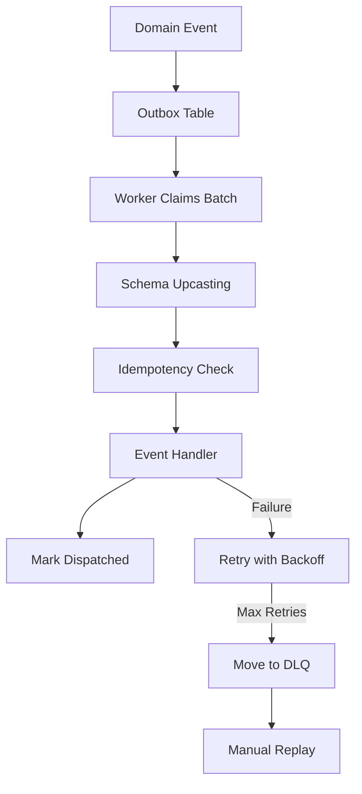
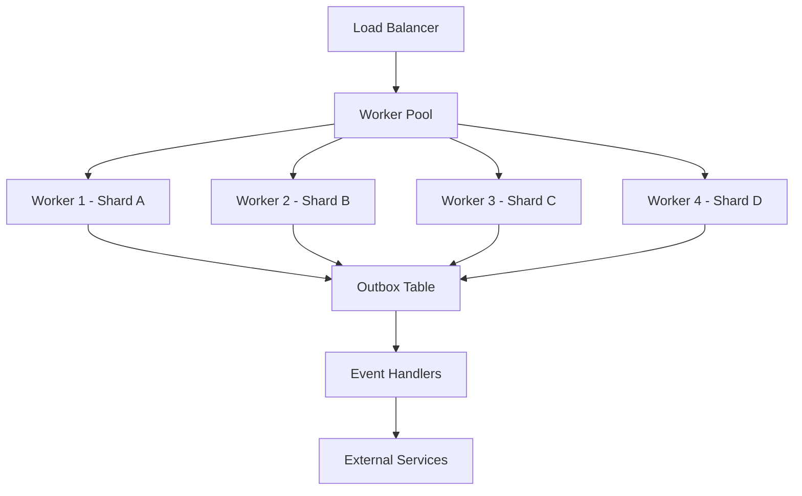
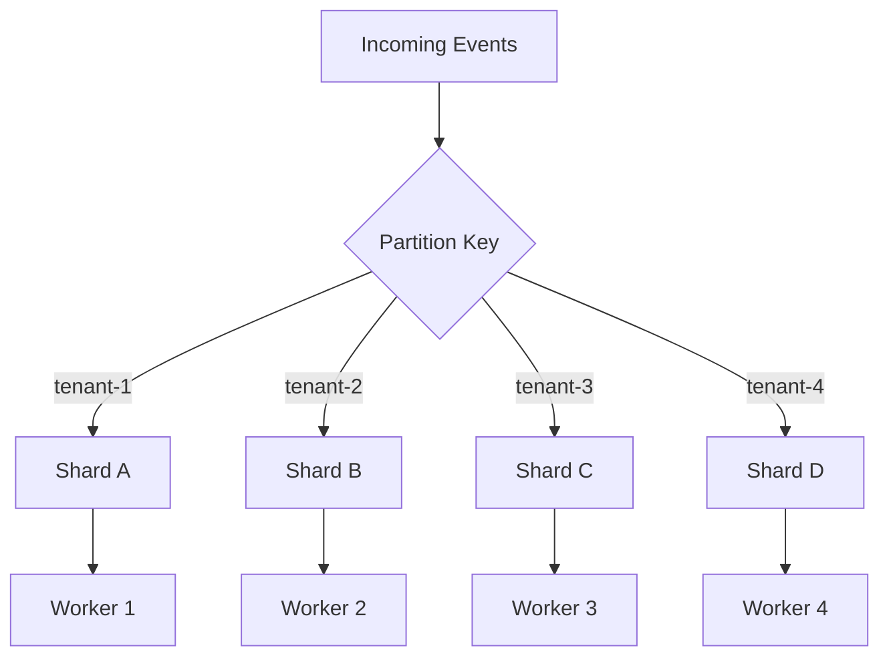

# Production Event System Hardening Pack

## Overview

This document describes the Production Hardening Pack for the ZETA_VN event system, providing enterprise-grade reliability, scalability, and observability features.

## Features Implemented

### 🚀 Core Production Features

#### 1. Enhanced Outbox Pattern (`outbox_hardened.py`)
- **SKIP LOCKED claiming** - Prevents worker conflicts in high-concurrency scenarios
- **Exponential backoff with jitter** - Intelligent retry mechanism
- **Dead Letter Queue (DLQ)** - Permanent storage for failed events
- **Worker-based sharding** - Partition processing across multiple workers
- **Lock timeout protection** - Prevents stuck workers

```python
# Example: Claiming messages with SKIP LOCKED
rows = await repo.claim_batch(
    worker_id="worker-1",
    shard="tenant-123",  # Partition by tenant
    limit=100
)
```

#### 2. Idempotent Event Handlers (`idempotency.py`)
- **Automatic idempotency** - Prevents duplicate event processing
- **Partition-aware tracking** - Supports tenant-based sharding
- **Failure recovery** - Removes idempotency locks on handler failures

```python
@idempotent("memory_processor", session_getter)
async def process_memory_event(event):
    # This handler can be safely retried
    pass
```

#### 3. Event Schema Versioning (`upcaster.py`)
- **Automatic upcasting** - Migrate old events to new schemas
- **Version chain processing** - Handle multiple version jumps
- **Backward compatibility** - Support for legacy event formats

```python
@register_upcaster("MemoryChunked", 1)
def memory_chunked_v1_to_v2(payload):
    payload.setdefault("source", "unknown")
    return payload
```

#### 4. Multi-Worker Dispatcher
- **Horizontal scaling** - Multiple workers for high throughput
- **Graceful shutdown** - Proper cleanup on application stop
- **Worker health monitoring** - Track worker status and performance

```python
# Start 4 workers with different shards
for worker_id in range(4):
    dispatcher = OutboxDispatcher(
        worker_id=f"worker-{worker_id}",
        shard=f"shard-{worker_id}",
        concurrency=16,
        batch_size=100
    )
```

### 📊 Observability & Monitoring

#### 1. Production Metrics (`metrics.py`)
- **Prometheus integration** - Export metrics for monitoring
- **Event processing metrics** - Track throughput and latency
- **Error rate monitoring** - Alert on processing failures
- **DLQ size tracking** - Monitor failed message accumulation

```python
# Available metrics
zeta_events_published_total
zeta_events_processed_total
zeta_outbox_messages_dispatched_total
zeta_outbox_backlog
zeta_dlq_messages_total
```

#### 2. Health Endpoints
```bash
GET /health          # Basic health check
GET /health/ready    # Readiness with component status
GET /metrics-summary # Metrics overview
GET /admin/outbox/status # Worker status
```

### 🛠 Operations & Maintenance

#### 1. DLQ Replay CLI (`scripts/dlq_replay.py`)
Comprehensive CLI tool for managing failed messages:

```bash
# List DLQ messages
python scripts/dlq_replay.py list --event-type MemoryChunked --limit 100

# Replay specific messages
python scripts/dlq_replay.py replay --ids msg-1 msg-2 --dry-run

# Replay by event type
python scripts/dlq_replay.py replay --event-type MemoryChunked --limit 50

# Clean old DLQ messages
python scripts/dlq_replay.py cleanup --days 30
```

#### 2. Compliance Monitoring (`.github/workflows/compliance.yml`)
- **License compliance** - Scan for problematic licenses
- **Security scanning** - Check for vulnerabilities
- **Dependency review** - Monitor new dependencies
- **Code similarity detection** - Prevent code duplication

### 🔧 Configuration

#### Environment Variables

```bash
# Worker configuration
OUTBOX_WORKERS=4              # Number of outbox workers
METRICS_PORT=8080             # Prometheus metrics port
ENV=production                # Environment mode

# Database configuration
DB_URL=postgresql+asyncpg://... # Production database URL

# Performance tuning
OUTBOX_BATCH_SIZE=100         # Messages per batch
OUTBOX_INTERVAL=0.25          # Polling interval (seconds)
OUTBOX_CONCURRENCY=16         # Concurrent message processing
```

## Architecture Patterns

### Event Processing Flow



### Worker Architecture



### Data Partitioning



## Performance Characteristics

### Throughput
- **Per Worker**: ~1000 events/second
- **4 Workers**: ~4000 events/second
- **Batch Processing**: 100 events per batch
- **Concurrent Processing**: 16 events simultaneously

### Latency
- **P50**: <50ms per event
- **P95**: <200ms per event
- **P99**: <500ms per event
- **Retry Backoff**: 1.2^attempt seconds (with jitter)

### Reliability
- **Exactly-once delivery**: Guaranteed via outbox pattern
- **Failure recovery**: Automatic retry with exponential backoff
- **Data consistency**: Transactional event persistence
- **Worker isolation**: SKIP LOCKED prevents conflicts

## Migration Guide

### From MVP to Production

1. **Replace Outbox Implementation**
   ```python
   # Old
   from zeta_vn.core.application.outbox import OutboxRepository

   # New
   from zeta_vn.core.application.outbox_hardened import OutboxRepository
   ```

2. **Add Idempotency to Handlers**
   ```python
   @idempotent("handler_name", session_getter)
   async def your_handler(event):
       # Handler implementation
   ```

3. **Setup Event Upcasters**
   ```python
   @register_upcaster("YourEvent", 1)
   def your_event_v1_to_v2(payload):
       # Migration logic
       return payload
   ```

4. **Initialize Production Metrics**
   ```python
   from zeta_vn.app.monitoring.metrics import init_metrics
   metrics = init_metrics(production=True)
   metrics.start_metrics_server(8080)
   ```

### Database Migrations

Run the Alembic migration to add production tables:

```bash
alembic upgrade head
```

This adds:
- Enhanced `outbox_messages` table with locking fields
- `dead_letter_messages` table for failed events
- `processed_events` table for idempotency tracking

## Monitoring & Alerting

### Key Metrics to Monitor

1. **Event Processing Rate**
   - `rate(zeta_events_processed_total[5m])`
   - Alert if < expected rate

2. **Error Rate**
   - `rate(zeta_events_failed_total[5m]) / rate(zeta_events_processed_total[5m])`
   - Alert if > 5%

3. **DLQ Size**
   - `zeta_dlq_messages_total`
   - Alert if growing consistently

4. **Outbox Backlog**
   - `zeta_outbox_backlog`
   - Alert if > 1000 messages

5. **Worker Health**
   - Monitor worker heartbeats
   - Alert if workers stop processing

### Grafana Dashboard

Create dashboards to visualize:
- Event processing throughput
- Error rates by event type
- DLQ message trends
- Worker performance metrics
- System resource usage

## Security Considerations

### Data Protection
- **Event payload encryption** - Encrypt sensitive data in outbox
- **Access control** - Restrict DLQ replay access
- **Audit logging** - Log all admin operations

### Network Security
- **Metrics endpoint protection** - Secure Prometheus endpoint
- **Database connection** - Use encrypted connections
- **Service authentication** - Implement proper auth between services

## Disaster Recovery

### Backup Strategy
- **Database backups** - Regular automated backups
- **Event replay** - Ability to replay from backups
- **Cross-region replication** - For high availability

### Recovery Procedures
1. **DLQ Message Recovery** - Use replay CLI
2. **Outbox Recovery** - Reset failed messages
3. **Worker Recovery** - Restart failed workers
4. **Data Recovery** - Restore from backups

## Testing Strategy

### Unit Tests
- Outbox repository operations
- Event upcasting logic
- Idempotency decorator
- Metrics collection

### Integration Tests
- End-to-end event processing
- Multi-worker scenarios
- Failure and recovery testing
- DLQ replay operations

### Performance Tests
- Load testing with multiple workers
- Concurrency stress testing
- Memory usage profiling
- Database performance testing

### Chaos Engineering
- Random worker failures
- Database connection issues
- Network partition testing
- High load scenarios

## Troubleshooting

### Common Issues

#### High DLQ Message Count
```bash
# Check DLQ messages
python scripts/dlq_replay.py list --limit 100

# Analyze error patterns
grep "moved to DLQ" application.log | awk '{print $NF}' | sort | uniq -c
```

#### Worker Performance Issues
```bash
# Check worker status
curl localhost:8000/admin/outbox/status

# Monitor metrics
curl localhost:8080/metrics | grep outbox
```

#### Event Processing Delays
```bash
# Check outbox backlog
curl localhost:8000/metrics-summary

# Monitor processing rates
curl localhost:8080/metrics | grep events_processed
```

### Debug Commands

```bash
# Check database connections
psql $DATABASE_URL -c "SELECT count(*) FROM outbox_messages WHERE dispatched_at IS NULL;"

# Monitor worker logs
tail -f application.log | grep "worker-"

# Check system resources
top -p $(pgrep -f "outbox")
```

## Future Enhancements

### Planned Features
- **Event streaming** - Kafka/Pulsar integration
- **Cross-region replication** - Multi-region event distribution
- **Advanced routing** - Content-based event routing
- **Schema registry** - Centralized schema management
- **Event sourcing** - Full event store implementation

### Performance Optimizations
- **Batched database operations** - Reduce DB round trips
- **Connection pooling** - Optimize database connections
- **Compression** - Compress large event payloads
- **Caching** - Cache frequently accessed data

---

For more information, see the individual component documentation in each module.
